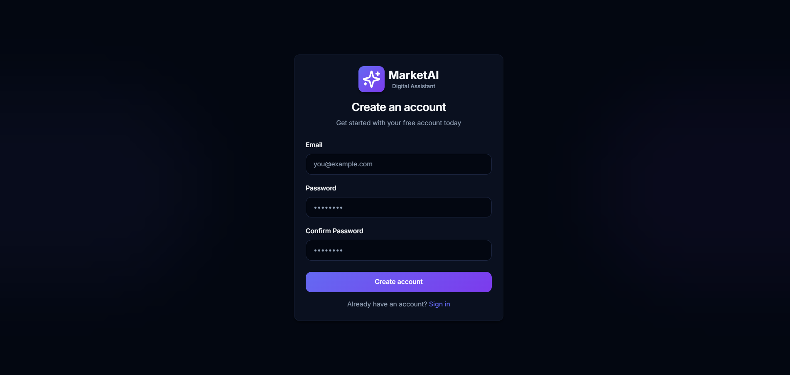
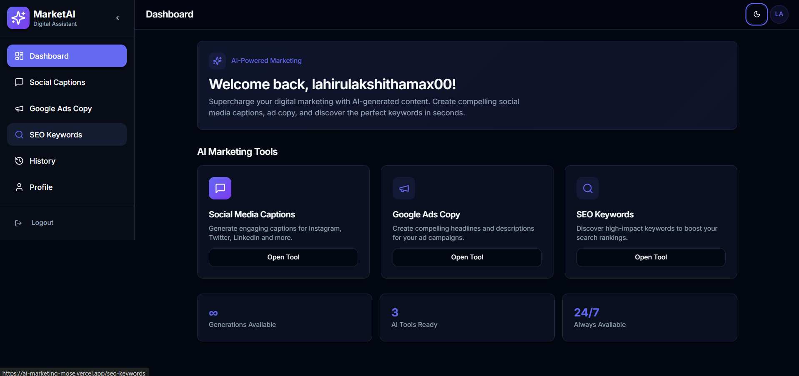
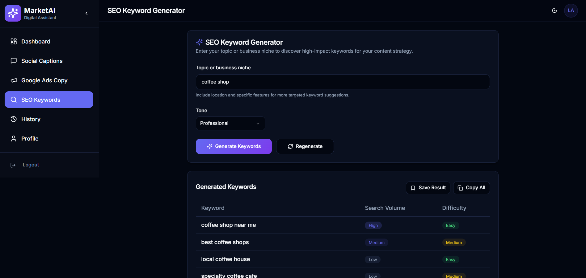
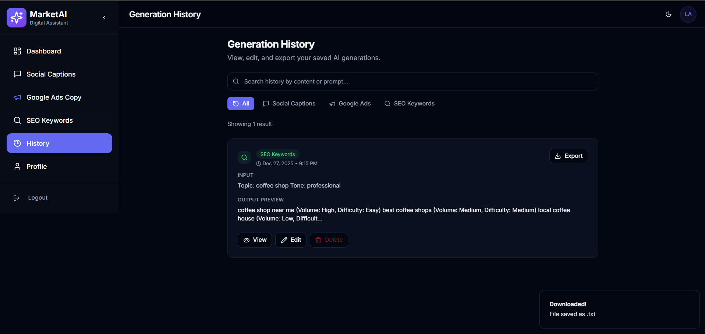

# 🚀 MarketAI – AI Digital Marketing Assistant

MarketAI is a modern SaaS-style AI application designed to help marketers, creators, and businesses generate high-quality digital marketing content in seconds.

It provides AI-powered tools for **social media captions**, **Google Ads copy**, and **SEO keyword generation**, with secure authentication and saved history for each user.

---

## 🌐 Live Demo

🔗 **Live App:**  
https://ai-marketing-mose.vercel.app

🔗 **GitHub Repository:**  
https://github.com/Lahiru-Lakshitha/AI-Marketing-Mose

---

## ✨ Features

### 🔐 Authentication
- Email & password signup and login
- Secure user sessions
- User-specific data isolation

### 🤖 AI Marketing Tools
- **Social Media Captions**
  - Generate engaging captions for Instagram, Twitter, LinkedIn, and more
- **Google Ads Copy**
  - Create high-converting ad headlines and descriptions
- **SEO Keywords**
  - Discover relevant, high-impact keywords for better rankings

### 💾 Save & History
- Save generated content with one click
- View full generation history
- Edit saved content
- Persistent storage per user

### 🎨 User Experience
- Clean, modern SaaS UI
- Dark mode design
- Loading skeletons and success/error notifications
- Responsive for desktop and mobile

---

## 🖼️ Screenshots

> _(Add screenshots by placing images inside a `/screenshots` folder and updating the paths below)_

### 🔐 Login Page

### 📊 Dashboard

### 🤖 AI Content Generation

### 📜 History Page

---

## 🧭 How to Use the App

1. **Sign Up / Log In**
   - Create a new account using your email and password

2. **Choose a Tool**
   - Social Media Captions  
   - Google Ads Copy  
   - SEO Keywords  

3. **Generate Content**
   - Enter your prompt
   - Select tone (if available)
   - Click Generate

4. **Save Results**
   - Click “Save” to store content in your history

5. **View History**
   - Access all saved generations
   - Edit or reuse content anytime

---

## 🛠️ Tech Stack

### Frontend
- React
- TypeScript
- Vite
- Tailwind CSS
- shadcn/ui

### Backend & Services
- Cloud-based authentication
- Cloud database with row-level security
- AI-powered edge functions

### Deployment
- Frontend hosted on **Vercel**
- Backend services managed via cloud infrastructure

---

## ⚙️ Environment Variables

To run this project locally, configure the following environment variables:

``env
VITE_SUPABASE_URL=your_project_url
VITE_SUPABASE_ANON_KEY=your_public_anon_key

🧑‍💻 Run Locally
#Clone the repository
git clone https://github.com/Lahiru-Lakshitha/AI-Marketing-Mose.git

# Navigate to project directory
cd AI-Marketing-Mose

# Install dependencies
npm install

# Start development server
npm run dev

👤 Author
👤 Author

Lahiru Lakshitha
📧 Email: lahirulakshithamax00@gmail.com
🌐 Portfolio: https://lahiru-lakshitha.github.io
💼 GitHub: https://github.com/Lahiru-Lakshitha
